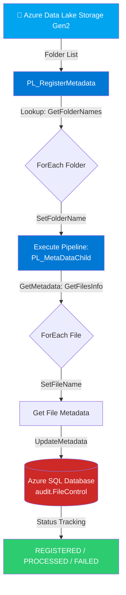
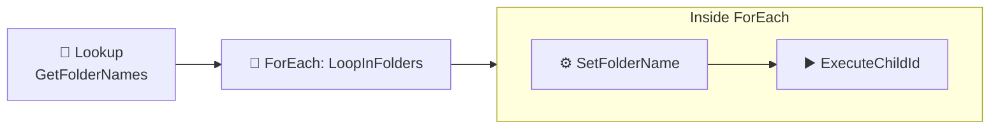
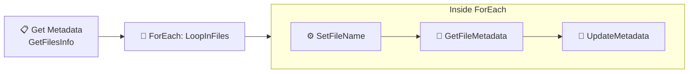
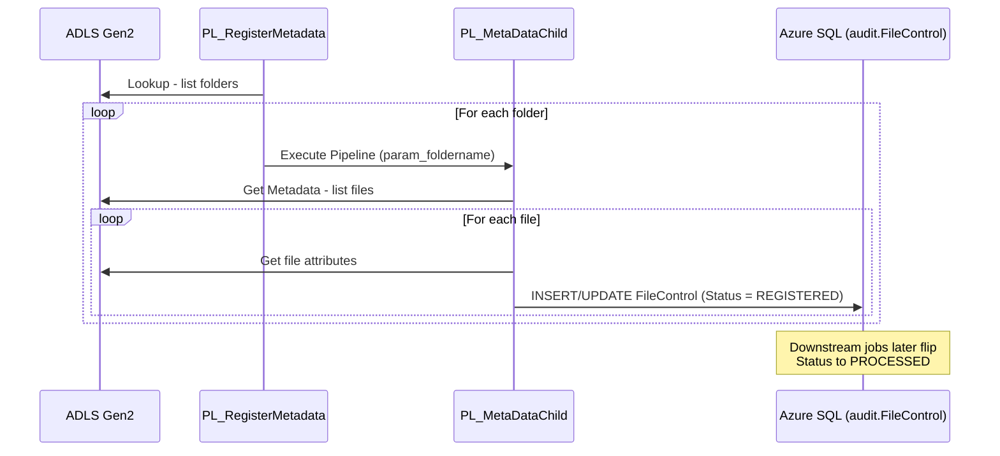

<div align="center">

# 🏗️ Azure Metadata-Driven Data Warehouse Framework

### *A dynamic, config-driven ingestion pipeline built on Azure Data Factory, Azure Data Lake Storage & Azure SQL Database*


</div>

---

## 🚀 Overview

This project implements a **fully metadata-driven ingestion framework** on Azure — meaning **zero hardcoded pipelines per source**. Instead of building one Data Factory pipeline per folder/file/table, the framework:

1. **Dynamically scans** folders and files sitting in Azure Data Lake Storage (ADLS Gen2)
2. **Registers metadata** for every file it discovers (name, size, last modified, status) into a **control table** in Azure SQL Database
3. **Tracks the lifecycle** of every file — `REGISTERED → PROCESSING → PROCESSED / FAILED`
4. Scales infinitely — drop a new folder/file into the lake and the framework **auto-discovers and registers it** with no pipeline changes required

This pattern is widely used in production-grade enterprise data warehouses because it decouples **orchestration logic** from **source-specific logic**, drastically reducing pipeline maintenance overhead.

---

## 🤔 Why Metadata-Driven?

| Traditional Approach ❌ | Metadata-Driven Approach ✅ |
|---|---|
| 1 pipeline per source/table | 1 generic pipeline for **all** sources |
| Manual pipeline changes for new files | New files auto-discovered & registered |
| No centralized audit trail | Full audit trail in `audit.FileControl` |
| Hard to track what's processed | `IsProcessed` + `Status` columns give instant visibility |
| Difficult to scale | Horizontally scales — just drop files into ADLS |

---

## 🏛️ Architecture



> 💡 The architecture follows a **parent-child pipeline pattern** — the parent discovers *folders*, and for each folder it invokes a reusable child pipeline that discovers *files* within that folder and registers their metadata.

---

## 🧰 Tech Stack

| Layer | Service | Purpose |
|---|---|---|
| **Orchestration** | Azure Data Factory (ADF) | Dynamic pipeline orchestration & scheduling |
| **Storage** | Azure Data Lake Storage Gen2 | Raw file landing zone (CSV files) |
| **Compute/Control DB** | Azure SQL Database | Metadata, audit & watermark control tables |
| **Dev Tooling** | SQL Server Management Studio (SSMS) | Querying/inspecting control tables |
| **Source Control** | Git (main branch, ADF Git integration) | Version-controlled pipeline definitions |

---

## 🔍 Pipeline Deep Dive

### 1️⃣ `PL_RegisterMetadata` (Parent Pipeline)

This is the **entry point** of the framework. Its job is to enumerate all top-level folders in the data lake and kick off metadata registration for each one.



| Activity | Type | Purpose |
|---|---|---|
| **GetFolderNames** | Lookup | Queries a config source (e.g. `audit.ETL_Config` or a lake directory listing) to retrieve the list of folders to process |
| **LoopInFolders** | ForEach | Iterates over every folder returned by the Lookup |
| **SetFolderName** | Set Variable | Captures the current folder name for use inside this iteration |
| **ExecuteChildId** | Execute Pipeline | Invokes `PL_MetaDataChild`, passing the folder name as a parameter |

---

### 2️⃣ `PL_MetaDataChild` (Child Pipeline)

Invoked once per folder by the parent pipeline. This pipeline drills one level deeper — into the **files** within a given folder — and registers each file's metadata.

**Pipeline Parameter:**

| Name | Type | Description |
|---|---|---|
| `param_foldername` | String | The folder name passed in from the parent pipeline |



| Activity | Type | Purpose |
|---|---|---|
| **GetFilesInfo** | Get Metadata | Lists all files inside `param_foldername` in ADLS, along with attributes like size and last-modified timestamp |
| **LoopInFiles** | ForEach | Iterates over every file discovered |
| **SetFileName** | Set Variable | Captures the current file name |
| **GetFileMetadata** | Get Metadata | Pulls detailed attributes for the specific file (size, last modified date) |
| **UpdateMetadata** | Stored Procedure / Script | Inserts or updates a row in `audit.FileControl` with the file's metadata and status |

---

## 🗄️ Database Design

The Azure SQL Database (`adfsqldatabase`) hosts an **`audit`** schema dedicated to pipeline observability:

| Table | Purpose |
|---|---|
| `audit.ETL_Config` | Drives the framework — stores source folder configs, active flags, and load rules |
| `audit.FileControl` | Central metadata/audit table — one row per file, tracking discovery & processing lifecycle |
| `audit.FileWatermarkControl` | Stores watermark values (e.g., last processed timestamp/id) for incremental loads |

### `audit.FileControl` — Schema

| Column | Type | Description |
|---|---|---|
| `TableName` | varchar | Target logical table the file maps to (e.g. `Customers`, `Products`, `Stores`) |
| `FileName` | varchar | Physical file name in the lake (e.g. `customers_0001.csv`) |
| `LastModified` | datetime | Last modified timestamp of the file in ADLS |
| `FileSize` | bigint / nullable | Size of the file in bytes |
| `IsProcessed` | bit | `0` = not yet processed, `1` = processed downstream |
| `Status` | varchar | Lifecycle state — `REGISTERED`, `PROCESSING`, `PROCESSED`, `FAILED` |
| `InsertedDate` | datetime | When the metadata row was first registered |
| `ProcessedDate` | datetime, nullable | When downstream processing completed |
| `UpdatedDate` | datetime, nullable | Last update timestamp for the row |

**Sample data captured via SSMS:**

```sql
SELECT * FROM audit.FileControl;
```

| TableName | FileName | Status | InsertedDate |
|---|---|---|---|
| Customers | customers_0001.csv | REGISTERED | 2026-07-18 16:47:27 |
| Customers | customers_0002.csv | REGISTERED | 2026-07-18 16:47:42 |
| Products | products_0001.csv | REGISTERED | 2026-07-18 16:49:11 |
| Stores | stores_0001.csv | REGISTERED | 2026-07-18 16:51:46 |

> 📌 Every file dropped into the lake gets its own row the moment the pipeline runs — giving a real-time audit trail of what's landed and what's been consumed downstream.

---

## 🔄 End-to-End Data Flow



---


## 📂 Folder Structure
 
```
📦 ADFSQL-METADRIVEN-PROJECT
 ┣ 📂 factory
 ┃ ┗ 📜 adfsqlproject.json                # ADF factory-level definition
 ┃
 ┣ 📂 pipeline
 ┃ ┣ 📜 PL_RegisterMetadata.json          # Parent pipeline
 ┃ ┗ 📜 PL_MetaDataChild.json             # Child pipeline
 ┃
 ┣ 📂 dataset
 ┃ ┗ 📜 *.json                            # ADF dataset definitions (source/sink)
 ┃
 ┣ 📂 linkedService
 ┃ ┗ 📜 AzureDataLakeStorage1.json        # Linked service to ADLS Gen2
 ┃
 ┣ 📂 Resources                           # Sample data + supporting assets
 ┃ ┣ 📂 Datasets
 ┃ ┃ ┣ 📂 Customers
 ┃ ┃ ┃ ┣ 📜 customers_0001.csv
 ┃ ┃ ┃ ┣ 📜 customers_0002.csv
 ┃ ┃ ┃ ┣ 📜 customers_0003.csv
 ┃ ┃ ┃ ┣ 📜 customers_0004.csv
 ┃ ┃ ┃ ┣ 📜 customers_0005.csv
 ┃ ┃ ┃ ┗ 📜 customers_0006.csv
 ┃ ┃ ┣ 📂 Products
 ┃ ┃ ┃ ┣ 📜 products_0001.csv
 ┃ ┃ ┃ ┣ 📜 products_0002.csv
 ┃ ┃ ┃ ┗ 📜 products_0003.csv
 ┃ ┃ ┗ 📂 Stores
 ┃ ┃   ┗ 📜 stores_0001.csv
 ┃ ┃
 ┃ ┣ 📂 Screenshots
 ┃ ┃ ┣ 🖼️ Screenshot 2026-07-19 210926.png   # PL_RegisterMetadata canvas
 ┃ ┃ ┣ 🖼️ Screenshot 2026-07-19 210943.png   # PL_MetaDataChild canvas
 ┃ ┃ ┗ 🖼️ Screenshot 2026-07-19 211149.png   # audit.FileControl in SSMS
 ┃ ┃
 ┃ ┗ 📂 Script
 ┃   ┗ 📜 Script.sql                      # SQL DDL/DML (audit schema & tables)
 ┃
 ┣ 📜 LICENSE                             # MIT License
 ┣ 📜 publish_config.json                 # ADF publish/deployment config
 ┗ 📜 README.md                           # You are here
```
 
> 🗂️ `factory`, `pipeline`, `dataset`, and `linkedService` are the standard **ADF Git-integration folders** (auto-generated when the Data Factory is connected to this repo's `main` branch). `Resources` is a custom folder holding the sample CSVs, the SQL script, and reference screenshots used throughout this README.
---

## ⚙️ Setup & Prerequisites

1. **Azure Subscription** with permissions to create Data Factory, ADLS Gen2, and Azure SQL Database
2. **Azure Data Factory** instance connected to a Git repo (main branch)
3. **Azure Data Lake Storage Gen2** account with a container for landing files
4. **Azure SQL Database** with the `audit` schema and control tables created (see `/sql` folder)
5. **Linked Services** in ADF for:
   - ADLS Gen2 (source)
   - Azure SQL Database (sink/control)
6. Deploy the two pipelines (`PL_RegisterMetadata`, `PL_MetaDataChild`) and set up a trigger (schedule or event-based) on `PL_RegisterMetadata`

---

## 🌱 Future Enhancements

- [ ] Add incremental/watermark-based file processing using `audit.FileWatermarkControl`
- [ ] Add a downstream **copy/ingest** pipeline that consumes `REGISTERED` files and flips status to `PROCESSED`
- [ ] Add email/Teams alerting on `FAILED` status rows
- [ ] Parameterize source system type (CSV, Parquet, JSON) via `audit.ETL_Config`
- [ ] Add Power BI dashboard on top of `audit.FileControl` for pipeline observability
- [ ] Migrate to Microsoft Fabric (Data Factory in Fabric) — "Migrate to Fabric" already visible in ADF UI

---

<div align="center">

## 👤 Author

**Khana Patro**
*Data Engineer 

⭐️ If you found this project useful, consider giving it a star!

</div>
